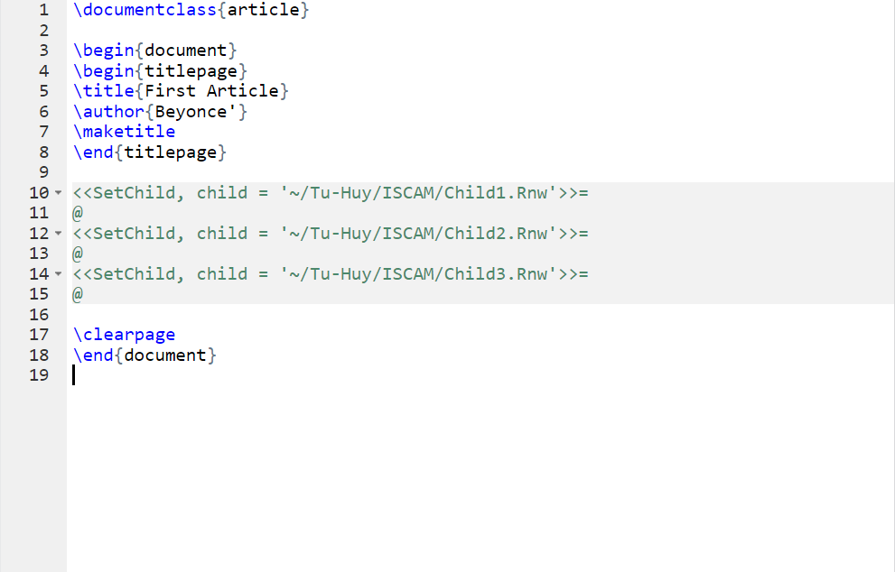

###Investigation 2.3: Readability of Cancer Pamphlets
The following tables indicate the number of patients at each reading level and the number of pamphlets at each readability level:

|Patient's reading level |    <3    |     3    |    4   |   5   |   6   |   7   |   8   |   9   |   10   |    11   |    12   |    >12   |
|:------------------:|:-------|--------|--------|--------|--------|--------|--------|--------|--------|--------|--------|--------|
|**Count** |    6   |   4   |   4   |   3   |   3   |   2    |    6   |   5   |   4   |   7   |   2   |   17    |

|Pamphlet’s readability level |   6   |   7   |   8   |   9   |   10   |    11   |    12   |    13   |    14   |    15   |    16   |
|:------------------:|:-------|--------|--------|--------|--------|--------|--------|--------|--------|--------|--------|--------|
|**Count** |    3   |   3   |   8   |   4   |   1   |   1    |    4   |   2   |   1   |   2   |   1   |

(a) How many of these patients had a 6th grade reading level?
*3*


(b) Explain why the form of the data does not allow you to calculate the mean reading skill of these cancer patients. 
*There are "<3" and ">12" data points that are listed abstractly and not explicitly in numeric format so the data does not allow you to calculate the mean reading skill of these cancer patients* 


(c) Determine median reading level for these patients. (Hint: Consider the counts, and remember there are 63 patients.)

```{r}
countPatient <-  c(6, 4, 4, 3, 3 ,2 ,6 ,5 ,4 , 7, 2, 17)
sum(countPatient)/2
```

```{r}
PatientRL <- c(rep(2, 6), rep (3,4 ), rep(4,4), rep(5,3), rep(6,3),  rep(7,2), rep(8,6) , rep(8,6), rep(9,5),  rep(10,4), rep(11,7), rep(12,2), rep(13,17))
Med_PRL <- median(PatientRL)
```
*The median of these cancer patients' reading level is `r Med_PRL`.*

(d) Determine the median readability level of these pamphlets
```{r}
countPamphlet <- rep(6:16, times = c(3, 3, 8, 4, 1, 1, 4, 2,1 ,2, 1))
Med_P <- median(countPamphlet)
```
*The median of readability level of these pamphlets is `r Med_P`.*

(e) How do these medians compare? Are the values fairly close?

*The median reading level for these patients and the median readability level of these pamphlets are the same or equal.*

(f) Does the closeness of these medians indicate the pamphlets are well matched to the patients’ reading levels? Explain. (Hint: You may want to perform some additional explorations of these data?) How would you respond to these researchers?

*Yes. It seems the phamplets are appropriately matched to the patients' reading levels. Therefore, I would respond these researchers that the pamphlets containing information for cancer patients are written at a level that the cancer patients can comprehend.*

###Investigation 2.4: The Ethan Allen

On October 5, 2005, a tour boat named the Ethan Allen capsized on Lake George in New York with 47 passengers aboard. In the inquiries that followed, it was suggested that the tour operators should have realized that the combined weight of so many passengers was likely to exceed the weight capacity of the boat. Could they have predicted this?

(c) What are the observational units and variable for this research question? Is this variable quantitative
or categorical? [Hint: Notice that the probability of interest does not pertain to individual passengers.]

*Observational units: 47 passengers aboard on the tour boat the Ethan Allen*

*Variable: The weight of the passengers. This variable is quantitative.*

d) Instead of focusing on the total weight of the 47 passengers, we can instead work with the average weight of the 47 passengers. Complete the following to indicate how these are equivalent:

```{r}
capacity <- 7500
n <- 47
Avg_W_SP <- capacity/n  
```

*Total weight of passengers > 7500 lbs when average weight of 47 passengers > `r Avg_W_SP`*


f) Do you think the distribution of sample means would have more variability, less variability, or the same variability as weights of individual people? Explain your answer.

*The distribution of sample means should be centered at the population mean(mu = 167). The distribution of sample mean is x_bar ~ N(mu = 167, sigma/sqrt(n) = 35/sqrt(47) = 5.1052747).*


h) Describe the shape, mean ($\mu$) and standard deviation ($\sigma$) of this population distribution (shown the histogram below the window).

*Note the applet computes $s$ not $\sigma$ because we are dealing with a sample but the problem asks for $\sigma$.*

```{r}
library(ggplot2)
site <- "http://rossmanchance.com/iscam2/data/WeightPop1.txt"
WD <- read.table(site, header = TRUE)
MU <- mean(WD$pop1)
SIGMA <- sqrt(sum((WD$pop1 - MU)^2)/length(WD$pop1))
c(MU, SIGMA)


ggplot(data = WD, aes(x = pop1)) +
  geom_histogram(binwidth = 0.5, fill = "light blue", colour = "light blue") +
  theme_bw() +  
  labs(x = "Population Distribution of 2000 adults weights") 
```

*The shape is unimodal behaving as a normal distribution. The mean ($\mu$) and the standard deviation ($\sigma$) of this population distribution are $`r MU`$ and $`r SIGMA`$ respectively.*    

(i) Describe the shape, center, and variability of this distribution. How does this sample distribution compare to the population distribution?

```{r}
set.seed(297)
x1 <- sample(WD$pop1, size = 47, replace= TRUE)
DF <- data.frame(x1)
ggplot(data = DF, aes(x = x1)) +
  geom_histogram(fill = "light blue", colour = "black") +
  theme_bw() +  
  labs(title = "First Random Sample of Adult Weights", x = "weights")
FIVE_N <- fivenum(x1)
IQR_Spread <- IQR(x1)
``` 

*The shape is quite hard to tell but it seemed to be more skewed left to me. The center of the distribution is at `r FIVE_N[3]` which is the median. 50% of the data points are between `r FIVE_N[2]` and `r FIVE_N[4]` with `r IQR_Spread` as it's interquartile range as this distribution's variability. This distribution does not look as normal as the population distribution.* 


(j) Press Draw Samples again. Did you obtain the same sample of 47 weights? Did you obtain the same sample mean? Do either of the two sample means generated thus far equal the population mean?

```{r}
x2 <- sample(WD$pop1, size = n, replace= TRUE)
head(x2)
head(x1)
c(mean(x1), mean(x2), MU)
```

*As shown above, I obtained different sample of 47 weights for drawing sample the second time. Neither the two sample means generated thus far equal the population mean. However, the first sample mean (`r mean(x1)`) was quite close to the population mean (`r MU`).*


(k) Continue to press Draw Samples 8 more times (for 10 samples total), and notice the variability in the resulting sample means from sample to sample. Is a pattern beginning to emerge in the Statistic distribution graph?

```{r}
sims <- 10
x10bar <- numeric(sims)
for(i in 3:sims){ 
  x10 <- sample(WD$pop1, size = n, replace= TRUE)
  x10bar[i] <- mean(x10)
}
x10bar[1] <- mean(x1)
x10bar[2] <- mean(x2)
x10bar
DF <- data.frame(x10bar)
ggplot(data = DF, aes(x = x10bar)) +
  geom_histogram(fill = "light blue", colour = "black") +
  theme_bw() +  
  labs(title = "Statistic Distribution Graph", x = "Means of 10 Samples") 
``` 

*Personally, 10 samples is too small for a pattern to emerge in the Statistic distribution graph. However, those sample means are quite close to the mean of the popular distribution.*

l) Now set the Number of Samples to 990 (for 1000 total) and press Draw Samples. Describe the shape, center, and variability of the distribution of the sample means (lower right). How do these compare to the population distribution? [Hints: Note the change in scaling. You can check the Population scale box to rescale back to the original population scaling and add the location of the population mean.] Which one of these features has changed the most, and how has it changed?

```{r}
set.seed(123)
sims <- 1000
xbar <- numeric(sims)
for(i in 1:sims){ 
  nd <- sample(WD$pop1, size = n, replace= TRUE)
  xbar[i] <- mean(nd)
}
DF <- data.frame(xbar)
ggplot(data = DF, aes(x = xbar)) +
  geom_density(fill = "pink", alpha = 0.3, color = "red") + 
  theme_bw()

variability <- SIGMA/sqrt(n)
Two_Stats <- c(mean(xbar),  sd(xbar))
Two_Stats
``` 

*The shape is unimodal behaving quite as a normal distribution. The estimated center and the variability of the distribution of the sample means are `r Two_Stats[1]` and  `r Two_Stats[2]`. The center or the mean of the population distribution stays the same as `r MU`. However, the standard deviation or the variability of the population distribution of population means is  $\frac{\sigma}{n} = \frac{`r SIGMA`}{`r n`} =$ `r variability`. Therefore, those characteristics from this distribution of the 1000 sample means are very similar to the population distribution.*


m) How can we use your simulated distribution of sample means to decide whether it is surprising that a boat with 47 passengers would exceed the (average) weight limit by chance (random sampling error) alone?

*We can count how many sample means are greater than the weight limit or the average weight of 47 passengers (`r Avg_W_SP`)*


n) To investigate the question posed in (m), specify the sample mean of interest (159.574) in the Count Sample box, use the pull-down menu to specify whether you want to count samples *Greater Than, Less Than, or Beyond (both directions)*. Press Count. What conclusions can you draw from this count?

```{r}
count <- mean(xbar >= Avg_W_SP)*100
```

*`r count`% are greater than the weight limit or the average weight of 47 passengers (`r Avg_W_SP`)*


###Summary

*In chapter 12, the author illustrates and guides the readers through the process of creating more complex LaTeX documents to present the readers' reproducible research. The previous chapters have helped the readers to create short documents, like articles and slideshows in LaTeX to showcase our research and findings which I have some knowledges of those skills already. Therefore, I found this chapter particularly quite useful. For instance, utilizing parent and child document structures using basic LaTeX and `knitr` tools would allow me to more easily work with very large presentation documents such as books. In particular, Pandoc can be combined with the previously mentioned tools to create documents using multiple markup languages. Moreover, in order to create multiple documents presenting information from subsets of our data, `brew` templates + `knitr` tools can be applied and manipulated in certain ways to serve that purpose.* 

####Example:

*The figure below is the snapshot of the Parent.Rnw file that acts as a parent or the main file to include the three children files of Child1.Rnw, Child2.Rnw, and Child3.Rnw.*


*Firstly, you started with `\documentclass{}` as a tag for the class of the document(book or article). Line 4-8 helps create the title page through `\begin{titlepage}` and `\end{titlepage}` as the frame with title's name (`\title{}`) and author's name (`\author{}`) listed. Finally, line 10-15 shows how using child code chunk option to include documents with `knitr`.*



*The pdf file below is the result from knitting the Parent.Rnw file to demonstrate the work that I did in the previous figure.*


```{r}
sessionInfo()
```
